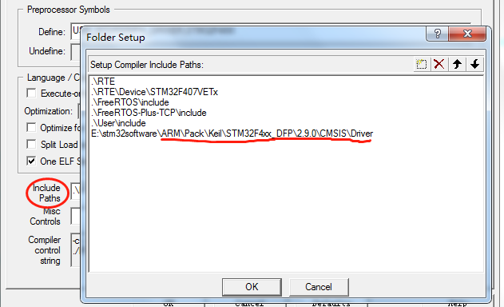

# Stm32-FreeRTOS-TCPIP
## FreeRTOS-TCPIP Keil proj on stm32F4
* Please install Keil.STM32F4xx_DFP.2.9.0.pack, and add the path "yourDir\Pack\Keil\STM32F4xx_DFP\2.9.0\CMSIS\Driver" in your include path
* Please put the network related tasks in the vApplicationIPNetworkEventHook function in netInfoConfig.c 

## Environment
* win7
* keil5 v5.23.0.0

## Hardward
* Stm32F4xx
* DP83848

## Dependency
* FreeRTOSv9.0.0 (have been included in this package)
* FreeRTOS-Plus-TCP() (have been included in this package)
* Keil.STM32F4xx_DFP.2.9.0.pack (Please pre-install)

## Related
* [FreeRTOS+TCP](https://www.freertos.org/FreeRTOS-Plus/FreeRTOS_Plus_TCP/index.html)

## Some config
### Proj structure

### Include Path

## Detailed configuration tutorial
* CSDN Blog(https://blog.csdn.net/weixin_37673586/article/details/79253597) (CN)
